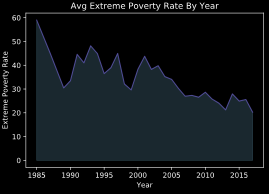

# Homework 1

All code for the assignment is in the source_code folder on github. Each file can be run executed upon opening. The files pull the data needed for each question directly from the GitHub Gapminder repository so no need for changing working directory or downlaoding data.

## Question 1

I received a score of 69% on the GapMinder test. Two of the questions that surprised me the most were the question that asked about percent of the world population with access to electicity as well as the question about vaccination rates. In both cases, I underestimated how high the percentages were. For both statistics, the world is at 80% coverage. This is quite a bit higher than I excpected. 

For the question, I choose to look at the question in the survey that asked about comparing the poverty rate from 20 years ago to today:

"In the last 20 years the proportion of people living in extreme poverty worldwide, has...? "

So I set out to look at historical poverty rates to see try and see how far the world has come at pulling people out of extreme poverty.

First I looked at the extreme poverty rate year over year to look at the trend as a whole. 

The GapMinder test stated that the extreme poverty rate has almost halved in the last 20 years. Based on this chart, we can see
that that looks to be true. In 2015, the average rate of extreme poverty gloabally was about 25% compared to just under 40% in 1995, nearly half in the 20 year period. One thing to note of issue with this dataset is that not each country has a value for each year, so years can be skewed by the presence or absence of certain countries that could shift averages.

## Question 2

For question 2, I looked at the change in Global GDP over time across the globe. I was attempting to leverage a slider scale in order to show the average GDP (adjusted for US) across years dynamically with a sliding scale that leverages year as the data point. However, I was having issues getting the slider to render within my working environment. So until I get that working, I captured the map with average GDP as the color scale for the years 1980 and 2000 to look and see the difference between the years.

It looks as though the GDP per capita rises for most countries, in line with expectations even after adjusting for inflation. This data also suffers from the same issue in question 1 where each country does not have a value for every year so certain years can have skewed data based on the presence or absence of certain countries. The best way to control for this would be to ensure you are comparing years that have the same country representation. 

## Question 3

For question 3, we are looking at the relationship between GDP Per Capita, Life Expectancy, and Mortality Rate over time. To do this, I leveraged multiple line charts plotting by year to look at how each of these variables changed over time. I then looked at a pairwise plot between the 3 variables to see if I could identify any strong correlation between the variables.

Looking at these charts, it would be fairly easy to draw a conclusion that all of these variables are related to each. It makes sense there is a strong relationship between GDP Per Capita rising with a rise in Life Expectancy and a decrease in Mortality Rate. However, it is also clear that GDP Per Capita has risen much slower than life expectancy and the mortality rate has decreases at a slower clip than the rise in GDP, leading me to believe their are other factors that have a strong impact on these rates. Much of the improvement in Life Expectancy and Mortality Rates likely has to do with improvements in medicine and access to clean water/sanitation more so than the GDP Per Capita.

These plots help to show that their is a negative correlation between life expectancy and mortality rates as expected as well as highlightin the positive correlation between GDP Per Capita and Life expectancy.

## Question 4

For question 4, I wanted to take a look at government healthcare spending and long term unemployment. My thinking was that their may be some relationship between the two as countries with higher healthcare spending may have reduced long term unemployment. The assumption here is that countries with higher healthcare spending likely have fewer people who need to claim long term unemployment for medical reasons. Much of long term unemployment is in response to serious medical issues so presumably coountries spending more on healthcare, especially preventative medice, will have fewere people who need to claim the long term unemployment due to medical reasons.

Based on the pairwise plot above, we can see that their actually looks to be the opposite relationship than what I had expected. It looks like their is actually some correlation between a higher government healthcare spend and the rate of long term unemployment. Without more information, the only conclusion I can draw is that their may be a relationship between countries that spend more on healthcare and the job opportunity rate. LIkely, their are other factors that have more impact long term unemployment that are not healthcare spending.

## Question 5

For this assignment, I leveraged static plots for most of the visualizations. I attempted to leverage a dynamic map chart that would have used a sliding scale that would change the year that is being displayed for GDP Per Capita. However, I was having issues rending the slide scale.

Advantages of Interactive Charts:
The biggest advantage of using interactive charts is that it gives the user/viewer of the visualizations more freedom in exploring the data themselves. The user can come up with their own questions they would like to answer and try and explore and come up with a solution themselves. 

Another big advantage of using interactive charts is scalability. Because you have to prepare and present the data in a more generic way where multiple data points need to be stored in the same way so you can switch between attributes displayed, it create a uniform way of storing and presenting data that allows these typed of chars to be scalable for use.

Disadvantages of Interactive Charts:
One of the diadvantages of building interactive charts is that the charts have to be generalized enough to be able to account for filtering, dynamic querying, etc. as opposed to building a chart to satisfy a specific question with speicific data needed to answer the question. So where a map could be a nice way to visualize geo based information, if not all the data is relevant to plotting in the same way, you may not be able to use a map and instead using a chart that is more generalizable.

The second biggest issue with using interactive charts is that it requires a certain konwledge base and skill set for a user to ensure that they are using the plots appropriately and understanding how to leverage the data at their disposal. This presents some risk when users have the ability to come up with their own ways of interacting with the charts.